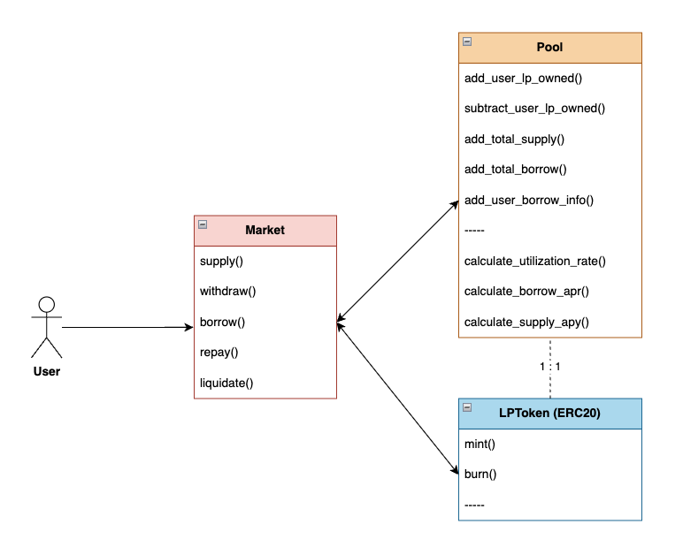
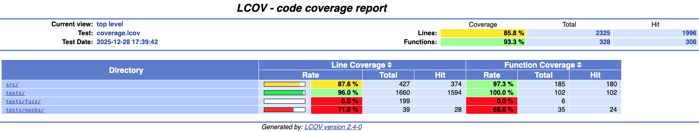

<h1 align="center">Starknet Lending</h1>

<p align="center">
  
  
  
  
</p>


## ✨ Overview

This repository contains a lending protocol implementation on Starknet,
built to explore core lending mechanics, interest accrual, and liquidation logic.

The focus of this project is smart contract correctness and security.

## 📄 High-level protocol design

<p align="center">
  
</p>

### Design highlights

- Market: User-facing entry point
- Pool: Liquidity, borrowing state & interest calculations
- LPToken (ERC20): Represents liquidity provider ownership, has a 1 : 1 relationship with its Pool
- Price Oracle (Chainlink): Provides reliable on-chain asset prices for collateral valuation and liquidation checks

## 🚀 Features

- Supply: Deposit assets into the pool and receive LP tokens representing pool ownership.
- Withdraw: Burn LP tokens to withdraw supplied assets plus accrued interest.
- Borrow: Borrow assets by locking collateral and creating a unique borrow position.
- Repay: Fully repay an active borrow position (principal + accrued interest) to close it.
- Liquidate: Liquidate under-collateralized borrow positions to maintain protocol solvency.

## 🔐 Invariants

The protocol is designed and tested against the following core invariants:

- Pool solvency: Total borrowed amount must always be smaller than or equal to 90% of total supplied liquidity plus accrued interest.
- Collateralization ratio: When a user borrows, the value of their collateral must be at least 150% of the borrowed value, based on oracle prices.
- Borrow positions: A borrow position must be fully repaid or liquidated to be closed.
- Collateral safety: Under-collateralized positions must be liquidatable.


## 🛠 Installation & Testing

Prerequisites
- Scarb 2.14.0
- Starknet Foundry 0.53.0

Clone the repo and from within the project's root folder run:

```bash
snforge test
```
  
The codebase is extensively tested using:
- Unit & integration tests for individual functions
- Representative fuzz tests

### Test Coverage
<p align="center">
  
</p>

## ⚠️ Disclaimer

This code is for educational purposes only, has not been audited,
and is provided without any warranties or guarantees.

## 📜 License

This project is licensed under the MIT License.

